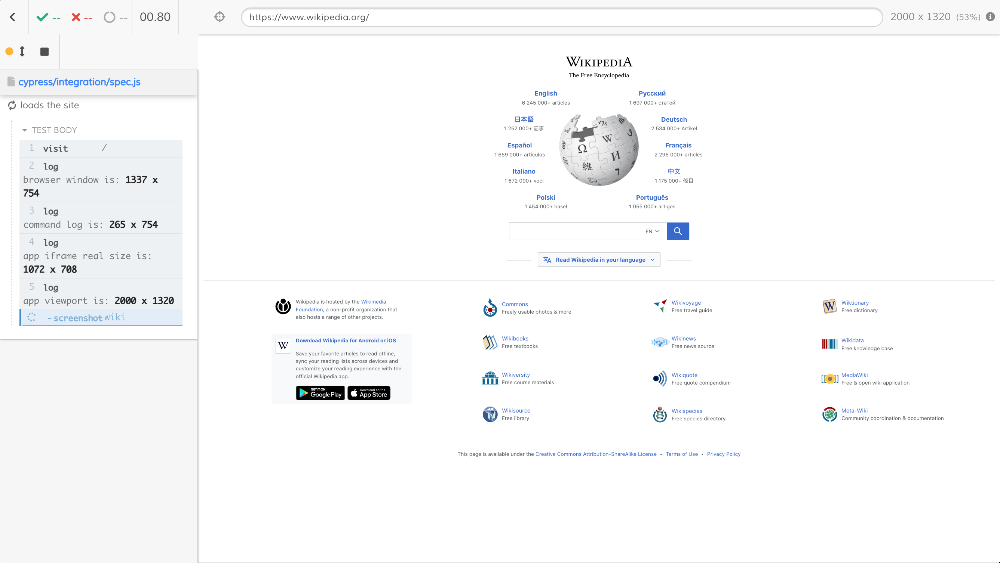

# cypress-wikipedia [![renovate-app badge][renovate-badge]][renovate-app]  [](https://dashboard.cypress.io/projects/j7giwe/runs)

Example showing how to get high resolution screenshots and videos during Cypress tests



Read the full blog post [Generate High-Resolution Videos and Screenshots](https://www.cypress.io/blog/2021/03/01/generate-high-resolution-videos-and-screenshots/).

Related: [Video resolution](https://github.com/cypress-io/cypress-example-recipes#fundamentals) recipe

## Install and use

Assumes the Chrome browser is already installed on your machine

```
npm install
npm test
```

This should generate 4k video and 4k screenshot

[renovate-badge]: https://img.shields.io/badge/renovate-app-blue.svg
[renovate-app]: https://renovateapp.com/
